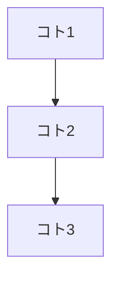

# Steps 0〜3: デザイン → 設計 → 骨格 → ハーネス

## 0: デザイン原則抽出

**入力**: ムードボード画像（Pinterest スクリーンショット等）
**出力**: .cursorrules + design-tokens.json

画像がなければ案内する:

```
ムードボード画像を貼ってください（Pinterest スクリーンショット等）。
以下の情報もあると精度が上がります:
- 用途:（アプリの目的）
- 主なユーザー:（ユーザー層）
- 使用環境:（PC / モバイル / 両方）
```

画像が添付されたら:

1. 画像を分析し、デザインの世界観を言語化
2. 以下を抽出:
   - カラーパレット（支配色 + アクセントの2軸構成。均等5色パレット禁止）
   - **状態カラー**: success / error / warning の3セット（各色 + light バリアント）
   - タイポグラフィ（Google Fonts から読み込み可能なもの）
   - 空間設計（角丸・余白・最大幅）
   - UIパターン（カード・ボタン・ホバー）
   - **シャドウ**: sm / md / lg + **focus ring 用** (`shadow.focus`)。`:focus` のハードコード防止
   - モーション（トランジション・禁止項目）
   - 背景（テクスチャ・グラデーション可否）
3. AI slop 回避:
   - Inter, Roboto, Arial, Open Sans, Lato, Space Grotesk 禁止
   - 紫グラデーション、ネオンカラー、彩度100%原色禁止
   - 純白 #FFFFFF 背景禁止（必ずオフホワイト）
   - 均等に色を散らした無難なパレット禁止
4. 抽出結果をテキストで提示し、調整を受け付ける
5. OK なら `.cursorrules` + `design-tokens.json` を生成

---

## 1: 設計ヒアリング

**入力**: アプリ要望 **出力**: 設計サマリ + index.html (HTML モック)
**前提**: .cursorrules + design-tokens.json がある

### ルール
- コードは出さない。設計サマリへの OK が出るまで禁止
- 1回の質問は最大5個
- 各 Round の最後に「ここまでの理解」をまとめて確認
- 回答のたびに **言い換えて確認**してから次へ進む（誤解のまま深掘りしない）
- ユーザーの **業務用語をそのまま使う**（勝手に一般化しない）
- 「何がうまくいかないか？」「想定外のケースは？」を優先して聞く（成功パスだけで設計しない）
- あいまいな点は **未解決の疑問**として明示して残す（“あとで何となく”で潰さない）
- 手描きカンプ添付時は要素を読み取って Round スキップ可

### 進め方（5フェーズ。迷ったらこの順）

1. **フェーズ1: 全体像**（1〜2ターン）  
   目的・スコープ・成功条件を決める（Round 1 の短縮版）
2. **フェーズ2: コトの発見（時系列）**（2〜3ターン）  
   “起きる出来事（コト）” を時系列で並べる（例: 入力→保存→一覧→編集→CSV）
3. **フェーズ3: コトの深掘り（ルール抽出）**（コトの数 × 1〜2ターン）  
   コトごとに「入力・判定・副作用・例外」を聞き、業務ルールを言語化する
4. **フェーズ4: 横断的関心事**（1〜2ターン）  
   セキュリティ（XSS/数式注入）・LockService・監査ログ・性能（setValues/チャンク）・タイムゾーン等をまとめる
5. **フェーズ5: 成果物整理**（1ターン）  
   設計サマリを埋め、未解決の疑問と次アクションを確定する

### フレーム（ヒト/モノ/コト。必ずコト起点）

- **ヒト**: 入力する人（スタッフ/受付/先生/患者/管理者など）、監査する人、システム（トリガー等）
- **モノ**: レコード、フォーム、CSV、添付ファイル、設定、ユーザー、権限、ログ
- **コト（出来事）**: 作成、更新、削除、検索、CSV出力、OCR実行、エラー/リトライ、ロック失敗

コトを並べると、必要な Spreadsheet 構成・サーバー関数・UI 状態が自然に決まる（ヒト/モノから始めて迷走しない）。

### 8 Round

- **Round 1: 誰が・何を・なぜ** — 目的、ユーザー像、PC/スマホ、既存代替手段、最重要操作
- **Round 2: 画面構成** — タブ数・名前・役割、フィールド一覧、画像添付有無、テーブル・ボタン一覧
- **Round 3: 外部サービス** — API、入出力、キー管理、失敗時フォールバック、JSON.parse 失敗時ハンドリング。**(1) パース失敗時に throw するか null で返すか (2) 範囲外の値をクランプするか警告するかエラーにするか**
- **Round 4: データ保存** — シート構成・列定義、主キー、正規化、日付列の意味。**getValues() の Date → YYYY-MM-DD 変換ルール確定**
- **Round 5: データの流れ** — 全経路、サーバー関数一覧（名前・引数shape・戻り値shape）、N+1 回避策。**クライアント↔サーバーの JSON shape を例で確定**
- **Round 6: バリデーション** — 各フィールドの型・範囲・エラーメッセージを表形式。**操作別バリデーション範囲、エラーキー = UI field ID ルール**
- **Round 7: 状態とフィードバック** — ローディング、成功/失敗、二重送信防止。**サーバーエラーの UI 反映方法、error key → field ID マッピング確定**
- **Round 8: 見落とし** — 認証、履歴、編集・削除、CSV、セキュリティ、LockService

### 設計サマリ出力

```
## 設計サマリ
### 概要（ツール名 / 目的 / ユーザー / 技術スタック）
### コトの連鎖（時系列）

### ヒト/モノ/コト（用語の棚卸し）
| 種別 | 候補 | メモ |
|------|------|------|
| ヒト |  |  |
| モノ |  |  |
| コト |  |  |
### サーバー関数（関数名 / 引数 shape JSON 例 / 戻り値 shape JSON 例 / 処理内容）
### Spreadsheet 構成（シート名 / 列定義）
### データの流れ（操作 → 処理 → 結果）
### レイヤー間契約
### バリデーション（フィールド / 型 / 範囲 / エラーキー / エラーメッセージ）
### 状態遷移
### セキュリティ
### 未解決の疑問（あとで潰す。放置しない）
```

### HTML モック出力（OK の後）
- バニラ HTML、1ファイル完結
- design-tokens.json の値を :root で CSS 変数定義
- 色・フォント・余白をハードコードしない
- 375px で横スクロールなし
- MOCK_MODE = true のモック版

---

## 2: プロジェクト骨格

**前提**: .cursorrules + design-tokens.json + index.html がある

1. .cursorrules をポインタのみ構成（50行以下）
2. .cursor/rules/agents.mdc 新規作成（80行以下）
3. specs/<アプリ名>.md（受け入れ仕様書）
4. tests/test-cases/<アプリ名>.md（テスト観点表）
5. タスク分解リスト提示
6. package.json（vitest, @biomejs/biome, @playwright/test, serve, @vitest/coverage-v8, lefthook）
7. biome.json
8. vitest.config.js（coverage.include: src/domain/ + src/application/ のみ）
9. playwright.config.js
10. .gitignore（gas/Code.gs 含める）
11. ディレクトリ: src/{domain,infrastructure,application}, gas/, scripts/, tests/{unit,integration,e2e}
12. scripts/build.sh（import/export 除去、test/spec 除外、domain→infrastructure→application 連結、node --check）
13. lefthook.yml（pre-commit: lint + build、pre-push: test）
14. .github/workflows/ci.yml
15. npm install → lefthook install → playwright install chromium → build:gas 初回確認

---

## 3: ルール・ハーネス

**前提**: Step 2 完了

以下の `.cursor/rules/*.mdc` を作成:

1. `.cursor/rules/gas-protect.mdc` — 設定ファイル保護（biome.json, vitest.config.js 等の編集禁止）、gas/Code.gs 直接編集禁止
   ```yaml
   ---
   description: GAS プロジェクトの設定ファイルとビルド生成物を保護する
   globs: "{biome.json,vitest.config.js,playwright.config.js,lefthook.yml,gas/Code.gs}"
   alwaysApply: false
   ---
   ```
2. `.cursor/rules/gas-quality.mdc` — src/ 編集後に `npx biome check src/` と `npm run build:gas` を実行するよう指示
   ```yaml
   ---
   description: src/ 編集後に lint + ビルドを促す
   globs: "src/**/*.js"
   alwaysApply: false
   ---
   ```
3. `.cursor/rules/agents.mdc` — セッション起動ルーチン + アーキテクチャ + コーディング規約
   ```yaml
   ---
   description: GAS アプリの実装規約とセッション起動手順
   alwaysApply: true
   ---
   ```
4. `.cursor/rules/design-rules.mdc` — デザイントークン運用・禁止事項
   ```yaml
   ---
   description: デザイントークン運用ルールとCSS変数規約
   globs: "index.html"
   alwaysApply: false
   ---
   ```
5. docs/adr/ に ADR テンプレート + 初期 ADR（ADR-001-biome, ADR-002-playwright, ADR-003-single-source-build）
