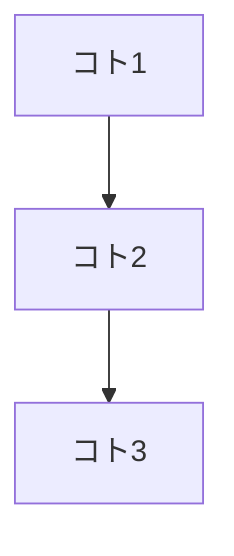

# 親 Step 0 / 1 — デザイン（GAS スキル型）・壁打ち

メイン番号表では **デザイン・要件は親 0 と親 1 の2段**（旧 1.5 は親 1 に統合、旧 1.6 は親 0 のリッチ枝）。

- **このファイルの見出し「Step 0」** → メインの **親 0**（ムードボード・トークン）。リッチメニューは [steps-rich-menu-wallball.md](steps-rich-menu-wallball.md) を任意で続ける。
- **このファイルの見出し「Step 1」** → メインの **親 1**（8 Round）。続けて **親 1** のブランド一貫性は [steps-brand-1-5.md](steps-brand-1-5.md)。

出力先は **Spreadsheet ではなく** `apps/web`（Tailwind v4）・必要なら `apps/liff`。

## Step 0 — ムードボード・デザイン原則抽出

**入力**: ムードボード画像（**Pinterest** のスクリーンショット、ボードのキャプチャ、参考 UI の貼り付け可）  
**出力**: `docs/design/design-tokens.json` + 短い `docs/design/moodboard-notes.md`（任意）※ユーザー OK 後に**必ずファイル化**（チャットだけにしない）  

**UI に「反映されない」とき**: トークン JSON を置いただけでは画面は変わらない。**同一ターンまたは次ターンで** `apps/web/src/app/globals.css` の `@theme`（または `:root`）へマッピングするまでが Step 0 の完了扱い（ユーザーが「ファイルだけ先」と言った場合は例外）。

**テンプレ修正での完了条件（強制）**:
- `docs/design/design-tokens.json` を作る
- `apps/web/src/app/globals.css` にマッピングし、主要画面（`/login` と `/`）の見た目差分が出ること
- LIFF も対象なら `apps/liff` に CSS 変数として反映し、`pnpm --filter liff build` が通ること（ビルド要件がある場合）

**同じ親 0 で続けてよいもの**: トークンが固まったら／並行で、**リッチメニュー**のレイアウト・CTA・JSON 壁打ち → [steps-rich-menu-wallball.md](steps-rich-menu-wallball.md)（サブ 0〜7）。

### 画像が無いとき

```
ムードボード画像を貼ってください（Pinterest のスクリーンショット等）。
あると精度が上がります:
- 対象:（管理画面のみ / LIFF のみ / 両方）
- 主なユーザー:（運用者 / エンドユーザー）
- 主に見る環境:（PC / スマホ）
```

### 画像があるとき（エージェントの作業）

1. 画像を分析し、世界観を言語化する。
2. 次を抽出する（GAS スキルと同粒度）:
   - **カラーパレット**（支配色 + アクセントの 2 軸。均等 5 色の無難パレットは避ける）
   - **状態色**: success / error / warning（各色 + light バリアント）
   - **タイポグラフィ**（Google Fonts やシステムフォントで再現可能なもの）
   - **空間**: 角丸・余白スケール・コンテナ最大幅
   - **UI パターン**: カード・ボタン・ホバー・境界線
   - **シャドウ**: sm / md / lg + **focus 用**（`focus-visible` をトークンで統一）
   - **モーション**: 許容する transition、避けたい演出
   - **背景**: オフホワイト／ニュートラル（真っ白 #FFFFFF だけにしない方針を推奨）
3. **AI slop 回避**（GAS と同型の禁止例をデフォルト採用。ユーザーが「企業 CI で Inter」と言ったらその限りではない）:
   - ありがちフォントの安易な選択、紫グラデ・ネオン・彩度 Max 原色の乱用を避ける
4. 抽出結果を**チャットで提示**し、ユーザーが調整できるようにする。
5. OK なら **`docs/design/design-tokens.json`** を生成（JSON: 色・フォント・radius・shadow・spacing のフラットまたはネスト構造でよい）。
6. **`docs/design/moodboard-notes.md`** に 3〜10 行で「なぜこのトークンか」を残す（任意・推奨）。

### このリポへの落とし込み（実装は Step 1 の後でもよい）

- **管理画面** `apps/web`: Tailwind v4 なら **`@theme`** または `:root` の CSS 変数**にトークンをマッピング**（`globals.css`）。ハードコード色の散在を避ける。
- **LIFF** `apps/liff`: トークンを CSS 変数で `:root` に置くか、最小限の共有 `docs/design` を参照して手で反映。

---

## Step 1 — 設計ヒアリング（壁打ち）

**入力**: 「何をしたいか」**出力**: **設計サマリ**（OK が出るまで**本番コードは書かない**。ワイヤー程度のモックはユーザー合意後に可）

### Step 1 の最初（Composer 2・domain-extractor 型）

Claude Code の **Agent Teams** のようにサブエージェントを自動起動はできない。**同じ Composer チャットで、下のブロックを順に貼って役割を切り替える**（[domain-extractor 型のチーム構成](https://zenn.dev/eda_sann/articles/fd3beee3aa610d) と同じ役割分担を、1スレッドで再現する）。

**進行の型（この順で固定）**

1. **ユーザー**: やりたいこと・背景を箇条書きで送る。
2. **ファシリテーター（通常の Composer）**: フェーズ1（全体像）の質問を **最大 5 個** → 回答を受けたら **言い換えて確認**してから次へ。
3. **業務分析家**: 下記「貼り付け用：業務分析家」を**そのまま貼る** → 出た コトの連鎖・表・ルール草案をユーザーが確認。
4. **レビュアー**: 下記「貼り付け用：レビュアー」を貼る → 漏れ・矛盾・未解決を列挙。
5. **ファシリテーターに復帰**: 下記「貼り付け用：ファシリテーター復帰」を貼る → 未解決を潰してから **8 Round** に入る（Round 2 以降は設計サマリの残りを埋める）。

**貼り付け用：業務分析家**

```text
あなたは業務分析家（サブ役割）です。これまでの会話のみを根拠に、次を出力してください。新しい質問はしない。

【原則】コト起点。ヒトやモノから話を始めない。ユーザーの業務用語はそのまま使う。

1) コトの連鎖：時系列で箇条書き（業務イベント）
2) Mermaid：flowchart TD でコトの連鎖を1本（ノード名は業務用語）
3) 表：ヒト / モノ / コト（Markdown表。種別｜候補｜メモ）
4) コトごとに業務ルール：入力・判定・副作用・例外（箇条書き）
5) ドメインオブジェクト候補：名前は業務用語のまま、関連コトを併記
```

**貼り付け用：レビュアー**

```text
あなたはレビュアー（サブ役割）です。これまでの会話と直前の業務分析家のアウトプットを検査し、次だけ出力する。新しい質問はしない。

1) 矛盾・用語のブレ
2) 漏れ（例外系・権限・失敗時・二重操作・オフライン）
3) LINE Harness 観点の未定：web / liff / worker / D1 のどこが空欄か
4) 未解決の疑問を箇条書き（ID を RUL-001 のように付与）
```

**貼り付け用：ファシリテーター復帰**

```text
役割をファシリテーター（メイン）に戻す。レビュアーの RUL を優先し、最大5問でヒアリングを続ける。各回答のあと言い換え確認。十分なら Step 1 の「8 Round」に入り、設計サマリのフォーマットに沿って埋めていく。
```

### ルール（GAS と同型）

- **1 回の質問は最大 5 個**。
- 各 Round の最後に **「ここまでの理解」** を短くまとめ、ユーザーに確認する。
- **回答のたびに“言い換え”で確認**してから次へ進む（誤解のまま深掘りしない）。
- ユーザーの **業務用語をそのまま使う**（勝手に一般化しない）。
- 「何がうまくいかないか？」「想定外のケースは？」を優先して聞く（成功パスだけで設計しない）。
- あいまいな点は **未解決の疑問**として明示して残す（“あとで何となく”で潰さない）。
- 手描き・Figma の**スクリーンショット**があれば要素を読み取り、該当 Round を圧縮してよい。
- **親 Step 0** のトークンと矛盾する UI 方針が出たら、トークン側を直すか UI を直すか決める。

### 進め方（5フェーズ。迷ったらこの順）

Zenn 記事の壁打ちフローを、このリポの Step 1 に合わせたテンプレ。

1. **フェーズ1: 全体像**（1〜2ターン）  
   目的・スコープ・成功条件を決める（Round 1 の短縮版）。
2. **フェーズ2: コトの発見（時系列）**（2〜3ターン）  
   “起きる出来事（コト）” を時系列で並べる（例: 友だち追加→認証→プロフィール紐付け→予約→通知）。
3. **フェーズ3: コトの深掘り（ルール抽出）**（コトの数 × 1〜2ターン）  
   コトごとに「入力・判定・副作用・例外」を聞き、業務ルールを言語化する。
4. **フェーズ4: 横断的関心事**（1〜2ターン）  
   認可/CORS/レート制限/監査ログ/再送/二重送信防止/個人情報など、共通ルールをまとめる。
5. **フェーズ5: 成果物整理**（1ターン）  
   設計サマリを埋め、未解決の疑問と次アクションを確定する。

### フレーム（ヒト/モノ/コト。必ずコト起点）

- **ヒト**: 管理者 / スタッフ / 友だち（エンドユーザー）/ システム（cron 等）
- **モノ**: 予約、プロフィール、タグ、メッセージ、セッション、LINEアカウント、Webhookイベント
- **コト（出来事）**: 友だち追加、LIFFログイン、プロフィール更新、予約作成/キャンセル、配信、エラー/BAN検知、移行

コトを並べると、API と DB と画面が自然に決まる（ヒト/モノから始めて迷走しない）。

### 8 Round（LINE Harness OSS 向けに GAS の Round を置き換え）

- **Round 1 — 誰が・何を・なぜ**  
  目的、ユーザー像（管理者 / 友だち）、**管理画面と LIFF のどちらが主か**、既存の代替手段、**最重要操作 3 つ**。

- **Round 2 — 画面・導線**  
  Next の**ルート候補**（`/friends` 等）、LIFF 内の**画面遷移**、一覧・詳細・フォームの有無、一覧表の列。

- **Round 3 — 外部・API**  
  **LINE**（Messaging / Login / LIFF）、**Worker 公開 URL**、Webhook、**失敗時**（再送・表示）、JSON のパース失敗時の扱い。

- **Round 4 — データ**  
  **D1** の既存テーブルとの関係、新規エンティティ、主キー、**`packages/db` の `schema.sql` / migrations** に載せるか。

- **Round 5 — データの流れ**  
  Webhook → Worker → DB、LIFF → OAuth → `POST /api/liff/profile` 等、**管理者 API**（`Authorization: Bearer` / session）の経路を文章化。**リクエスト／レスポンスの JSON 例**を 1 つ以上。

- **Round 6 — バリデーション**  
  フィールドごとの型・範囲・**エラーメッセージ**（日本語）。**エラーキーと UI の対応**。

- **Round 7 — 状態とフィードバック**  
  ローディング、成功・失敗トースト、**二重送信防止**、オフライン時の扱い。

- **Round 8 — 見落とし**  
  **認可**（公開ルートと `authMiddleware`）、**CORS**（`WEB_URL` / `ALLOWED_ORIGINS`）、**LIFF_URL** と Login リンク、シークレットの置き場所、レート制限、個人情報・ログ。

### 設計サマリの出力フォーマット（OK までこれを埋める）

```markdown
## 設計サマリ
### 概要（機能名 / 目的 / ユーザー / 触るアプリ: web | liff | worker）
### コトの連鎖（時系列）

### ヒト/モノ/コト（用語の棚卸し）
| 種別 | 候補 | メモ |
|------|------|------|
| ヒト |  |  |
| モノ |  |  |
| コト |  |  |
### 画面・ルート（Next / LIFF）
### API・Worker（メソッド / パス / 認可 / リクエスト・レスポンス例）
### D1（テーブル・マイグレーション方針）
### データの流れ（イベント → 処理 → 結果）
### バリデーション（フィールド / ルール / メッセージ）
### 状態・UX（ローディング / エラー表示）
### セキュリティ・運用（秘密情報・CORS・LIFF）
### 未解決の疑問（あとで潰す。放置しない）
```

### 設計サマリ OK 後（必須＋任意）

- **リポに残す（必須）**: ユーザーが OK した設計サマリを、チャットと**同一内容**で **`docs/design/hearing-summary.md`** に書く（上記「設計サマリの出力フォーマット」の見出し構造でよい）。**壁打ちが「反映されない」主因は、ここを飛ばしてチャットだけで終わること**。
- **テンプレ反映の指示（必須）**: `hearing-summary.md` の各節に「反映先ファイル」を紐付け、以降の実装・テストの差分が機械的に切れる状態にする（例: CORS → `apps/worker/src/index.ts` + `wrangler.toml` / `/auth/line` → `apps/web/src/app/page.tsx` + `apps/worker/src/routes/liff.ts`）。
- **ワイヤー**（任意）: Markdown の表／箇条書きで画面一覧、または単一 HTML の**低忠実度モック**（トークンは CSS 変数で参照）。
- **次のステップ**: まず [steps-harness.md](steps-harness.md) の **Step 2** でゲートとコマンドを把握する。続けて [steps-0-3-red-green-refactor.md](steps-0-3-red-green-refactor.md) の **Step 3（観点）** に進み、受け入れ条件をテスト名まで落とす。

---

## ステップの位置づけ

| いつ使うか | 使う Step |
|------------|-----------|
| 新規画面・ブランド寄せ・リニューアル | **0 → 1 → 2**（ハーネス）→ TDD（Step 3〜） |
| バグ修正・API のみ | **0〜1 をスキップ**可。必要なら **Step 2** のあと **Step 3** から |
| デプロイ・インフラのみ | [steps-deploy.md](steps-deploy.md) の **Step 12** |
